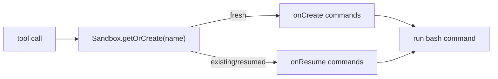

# Vercel

The `vercel` provider runs commands through [`@vercel/sandbox`](https://vercel.com/docs/sandbox).
The SDK is loaded lazily by the harness, and persistent sandboxes are named by the same
reservation key used by the other providers (`reservationKey ?? namespace`).

## Config

```jsonc
{
  "name": "vercel",
  "config": {
    "provider": "vercel",
    "persistent": true,
    "network": {
      "mode": "restricted",
      "allowDomains": ["api.example.com"],
      "allowCidrs": ["10.0.0.0/8"]
    },
    "permissionMode": "bypass",
    "onCreate": ["npm install"],
    "onResume": ["test -d node_modules"],
    "options": {
      "token": "vercel-token",
      "teamId": "team_xxx",
      "projectId": "prj_xxx",
      "runtime": "node24"
    }
  }
}
```

`options.token`, `options.teamId`, and `options.projectId` can be omitted when the harness
environment provides `VERCEL_TOKEN`, `VERCEL_TEAM_ID`, and `VERCEL_PROJECT_ID`. `runtime`
defaults to `node24`.

## Lifecycle

Vercel has native per-call lifecycle hooks, so the executor passes `onCreate` and `onResume`
to `Sandbox.getOrCreate()`/`Sandbox.get()` instead of emulating them with marker files.

Two semantic differences from the other persistent providers:

- **`onResume` timing**: on Vercel the hook fires only when a *stopped* sandbox actually
  resumes. E2B/Daytona/Kubernetes run `onResume` on every call (they cannot tell a fresh
  reconnect from a resume), so write hooks that are idempotent either way.
- **Idle timeout**: Vercel's `timeout` counts from sandbox start, not from last activity.
  The executor maps `lifecycle.idleTimeoutSeconds` onto it, so a persistent Vercel sandbox
  stops that many seconds after each wake — even mid-activity — and resumes on the next
  call. `lifecycle.maxLifetimeSeconds` is not enforced on Vercel.



## Network

Vercel enforces all three normalized modes natively:

| Mode | Vercel mapping |
| --- | --- |
| `allow-all` | `networkPolicy: "allow-all"` |
| `deny-all` | `networkPolicy: "deny-all"` |
| `restricted` | `networkPolicy.allow` for domains and `networkPolicy.subnets.allow` for CIDRs |

## Workspace Storage Caveat

A workspace backed by a persistent Vercel sandbox lives on Vercel's filesystem. It is not
mounted from the shared S3 workspace bucket and is not shared with Lambda, Daytona, or
Kubernetes sandboxes. Use it when the agent and workspace are intentionally Vercel-only.
The workspace config value `storage.provider: "vercel"` labels this setup but does not
itself switch any behavior — the persistence comes from the sandbox. Note `MEMORY.md`
prompt loading always reads from S3, so a Vercel-only workspace's `MEMORY.md` does not
reach the system prompt.

Without `persistent: true`, the Vercel provider still works for stateless `bash`
(create → run → stop per call), but workspace-backed file tools are unavailable.

## Background Jobs

Persistent Vercel sandboxes support `bash` background jobs and `async_status` using the same
`.fp-jobs` marker scripts as E2B and Daytona. Auto-delivery still needs egress to the harness
Function URL; with `deny-all` the job runs, but completion must be fetched by polling.
