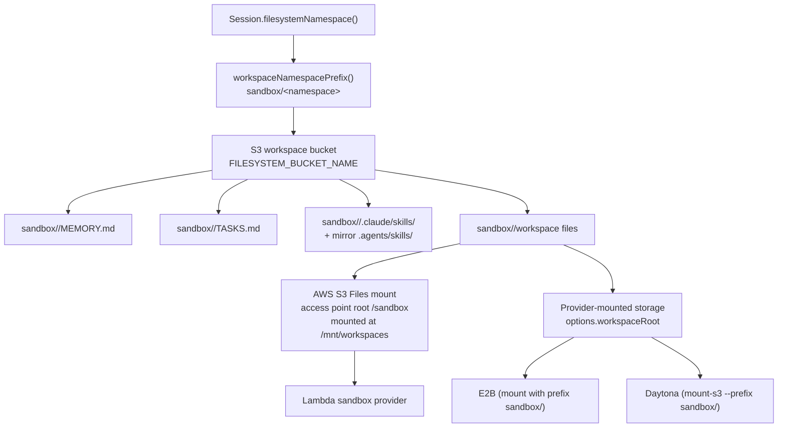

# Storage

Storage is the filesystem backing for Workspace. The current runtime supports `config.workspace.storage.provider: "s3"` only.

`workspace.storage` declares the shared backing store used by:

- `MEMORY.md`, `TASKS.md`, and other developer-defined markdown files
- files read and written by the `bash` sandbox tool
- staged skill bundles under `.skills/<skill-name>`
- mounted workspace paths used by Lambda, E2B, and Daytona sandbox providers

## Current Architecture

> [!WARNING]
> **The workspace mount key prefix is load-bearing — keep it in sync.**
> The Lambda S3 Files access point is rooted at a non-root sub-path `/sandbox`
> (`SandboxS3FilesAccessPoint.rootDirectories` in `sst.config.ts`). It **must** be a
> sub-path, not `/`: the access point's `creationPermissions` (777, uid/gid 1000) are
> only applied to a directory it *creates*. The bucket root already exists, so a root
> of `/` is **not writable** by the sandbox uid and `bash` writes fail (this was the
> bug fixed by git commit `2bdb34f`). Because of that sub-path, the mount stores every
> file under the `sandbox/` key prefix. Every harness-side S3 read/write of workspace
> files therefore applies the same prefix via `workspaceNamespacePrefix()`
> (`WORKSPACE_MOUNT_PREFIX` in `functions/_shared/sandbox.ts`). **If you change one,
> change the other.** When they drift, the harness and sandbox read/write two separate
> key trees and silently stop seeing each other's files — `publish_skill_changes` loses
> bash-written files and a freshly loaded skill shows an empty mount.

Sandbox paths map to S3 keys through that prefix: the bucket holds `sandbox/<namespace>/...` and the mount exposes it at `/mnt/workspaces/<namespace>/...`.



The Lambda sandbox provider uses AWS S3 Files at `/mnt/workspaces`, backed by the same workspace bucket through an access point rooted at `/sandbox`. `SandboxBash` writes directly through that mount. Daytona mounts the workspace bucket with `mount-s3 --prefix sandbox/`; E2B must expose the same prefixed namespace under `config.workspace.sandbox.options.workspaceRoot`. Otherwise the provider can start but the file the agent just wrote will not be present.

Skills are checked out git-style: the account skill bucket is the source of truth, `load_skill` clones a working copy into `<namespace>/.claude/skills/<name>` (and mirrors it to `<namespace>/.agents/skills/<name>` for tool discovery), the agent edits the `.claude/skills` copy, and `publish_skill_changes` pushes it back. See [`skills.md`](../skills.md).

## Reading workspace files: S3 API vs the sandbox mount

There are two ways to reach the same workspace bytes, and they are **not** interchangeable because the mount syncs to the bucket asymmetrically:

- **bucket → mount** (a file the harness wrote with S3 `PutObject`/`CopyObject`): visible through the mount **immediately**.
- **mount → bucket** (a file the agent wrote through `bash`/NFS): visible through the mount immediately, but the S3 API does **not** list/return it for **~1–2 minutes** (AWS S3 Files writes back to the bucket asynchronously — measured: not visible at +0s/+45s, visible at +120s).

So pick the door by **who last wrote the file**, not by how much time has passed. There is no timer or "switch to the mount after writing" — each read site is wired to the correct door:

| Reading… | Last writer | Read via | Rationale |
| --- | --- | --- | --- |
| Agent-written workspace files (skill edits, agent-created files, agent-edited `MEMORY.md`) | sandbox, through the mount | **Sandbox mount** — `WorkspaceSandboxExecutor.readDirectory` (`read-dir`) / `bash` | the S3 API is stale for up to ~2 min, so it would miss the agent's edits |
| Harness-written workspace files (`.stage.json` manifest, the staged copy `load_skill` wrote, sandbox artifact write-back) | harness, via S3 | **S3 API** (`functions/_shared/s3.ts`) | already in the bucket and instantly correct through both doors; no sandbox round-trip needed |
| Account skill bucket (the skill "origin") | harness, via S3 | **S3 API** | a separate bucket, never mounted |

The agent always reads through the mount (its `bash` tool *is* the mount), so it always sees its own writes instantly regardless of elapsed time. The S3-API-vs-mount decision only applies to **harness-side reads**.

Concretely, `publishStagedSkillBundle` reads the working copy under `.claude/skills/<name>` through the mount (`read-dir`), but reads its `.stage.json` manifest and the source skill through the S3 API — because the harness wrote those.

> **Known exception:** `Session.loadMemoryFile` reads `MEMORY.md` through the **S3 API** at the start of each turn. If the agent edited `MEMORY.md` less than ~2 min earlier in the same session, that read can be stale. This is accepted today (memory converges across turns and a sandbox round-trip on every turn is costly); route it through the mount (`read-dir`) if prompt-time freshness ever becomes a hard requirement.

## Configuration

```json
{
  "config": {
    "workspace": {
      "enabled": true,
      "storage": {
        "provider": "s3"
      }
    }
  }
}
```

If `workspace.storage` is omitted, config normalization fills in `{ "provider": "s3" }`.

## Future External Storage

Additional work can add external storage providers such as Google Drive, Google Cloud Storage, Cloudflare R2, or other mounted object stores. Those providers should still connect through the sandbox mount model:

- keep one logical workspace namespace for memory notes, task notes, staged skills, and files
- mount or sync that namespace into `options.workspaceRoot`
- keep files visible to the sandbox runtime
- avoid provider-specific logic inside `session.ts` or the core agent loop

This keeps Workspace behavior consistent while allowing different storage backends underneath the sandbox mount.

## Related Code

| Concern | Code |
| --- | --- |
| Storage config validation and defaulting | [`functions/_shared/storage/agent-config.ts`](https://github.com/beeblastco/filthy-panty/blob/main/functions/_shared/storage/agent-config.ts) |
| S3 read/write helpers | [`functions/_shared/s3.ts`](https://github.com/beeblastco/filthy-panty/blob/main/functions/_shared/s3.ts) |
| Namespace hashing | [`functions/_shared/runtime-keys.ts`](https://github.com/beeblastco/filthy-panty/blob/main/functions/_shared/runtime-keys.ts) |
| Lambda S3 Files infrastructure | [`sst.config.ts`](https://github.com/beeblastco/filthy-panty/blob/main/sst.config.ts) |
