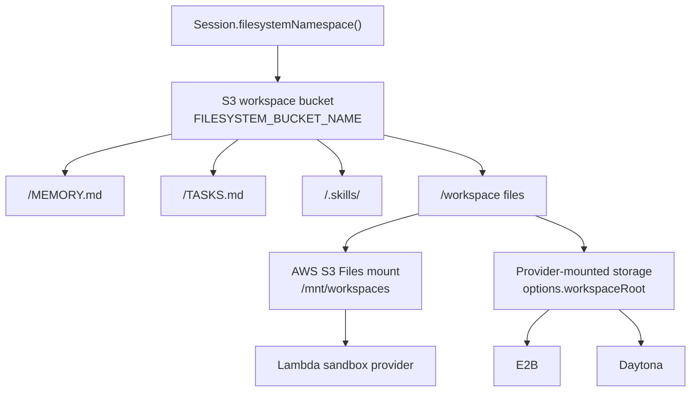

# Storage

Storage is the filesystem backing for Workspace. The current runtime supports `config.workspace.storage.provider: "s3"` only.

`workspace.storage` declares the shared backing store used by:

- `MEMORY.md`, `TASKS.md`, and other developer-defined markdown files
- files read and written by the `bash` sandbox tool
- staged skill bundles under `.skills/<skill-name>`
- mounted workspace paths used by Lambda, E2B, and Daytona sandbox providers

## Current Architecture



The Lambda sandbox provider uses AWS S3 Files at `/mnt/workspaces`, backed by the same workspace bucket. `SandboxBash` writes directly through that mount. E2B and Daytona must expose the same bucket namespace under `config.workspace.sandbox.options.workspaceRoot`; otherwise the provider can start but the file the agent just wrote will not be present.

## Configuration

```json
{
  "config": {
    "workspace": {
      "enabled": true,
      "storage": {
        "provider": "s3"
      }
    }
  }
}
```

If `workspace.storage` is omitted, config normalization fills in `{ "provider": "s3" }`.

## Future External Storage

Additional work can add external storage providers such as Google Drive, Google Cloud Storage, Cloudflare R2, or other mounted object stores. Those providers should still connect through the sandbox mount model:

- keep one logical workspace namespace for memory notes, task notes, staged skills, and files
- mount or sync that namespace into `options.workspaceRoot`
- keep files visible to the sandbox runtime
- avoid provider-specific logic inside `session.ts` or the core agent loop

This keeps Workspace behavior consistent while allowing different storage backends underneath the sandbox mount.

## Related Code

| Concern | Code |
| --- | --- |
| Storage config validation and defaulting | [`functions/_shared/storage/agent-config.ts`](https://github.com/beeblastco/filthy-panty/blob/main/functions/_shared/storage/agent-config.ts) |
| S3 read/write helpers | [`functions/_shared/s3.ts`](https://github.com/beeblastco/filthy-panty/blob/main/functions/_shared/s3.ts) |
| Namespace hashing | [`functions/_shared/runtime-keys.ts`](https://github.com/beeblastco/filthy-panty/blob/main/functions/_shared/runtime-keys.ts) |
| Lambda S3 Files infrastructure | [`sst.config.ts`](https://github.com/beeblastco/filthy-panty/blob/main/sst.config.ts) |
