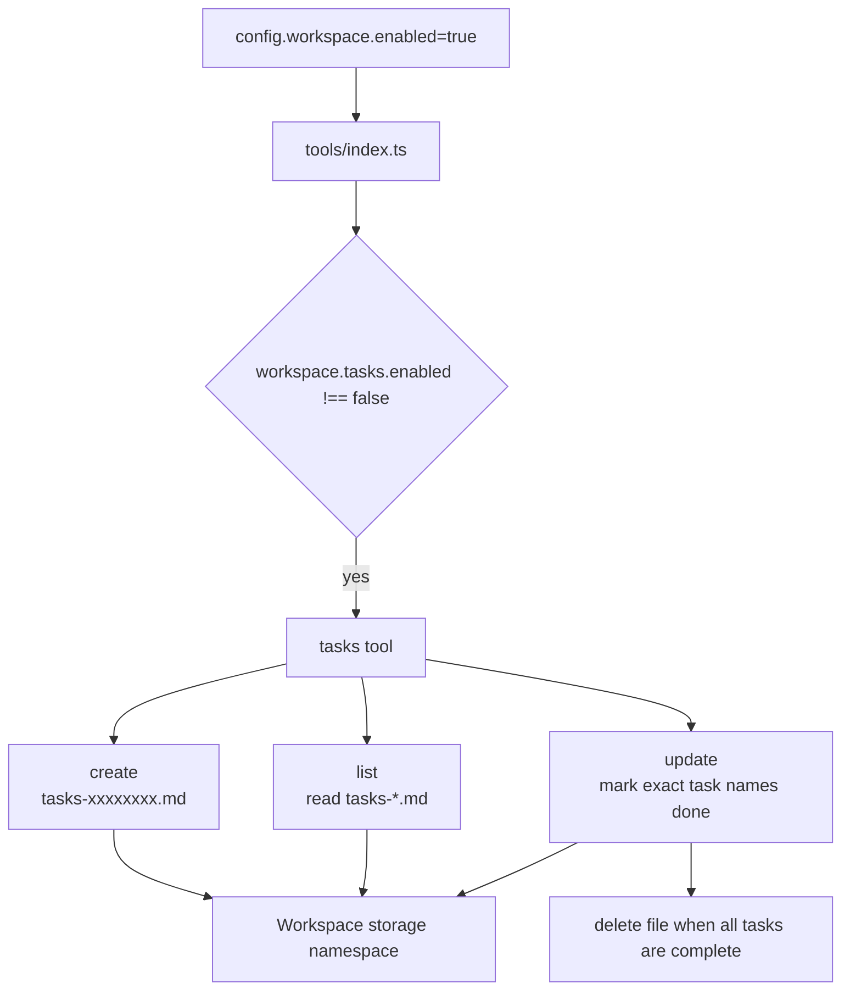

# Tasks

Tasks are workspace-backed markdown task lists. They are exposed to the model as the `tasks` tool when `config.workspace.enabled` is true, unless `config.workspace.tasks.enabled` is false.

The feature is for long-running or complex requests where the agent needs an explicit checklist to avoid drifting. It follows the same practical pattern as `TODO.md` files, Codex task tracking, and Claude Code task features: write the plan down, mark completed work, and remove the list when all work is done.

## Runtime Flow



## What the Tool Does

The implementation is in [`functions/harness-processing/tools/tasks.tool.ts`](https://github.com/beeblastco/filthy-panty/blob/main/functions/harness-processing/tools/tasks.tool.ts).

It supports three commands:

| Command | Required fields | Behavior |
| --- | --- | --- |
| `create` | `title`, `tasks` | Creates a new markdown task file with unchecked items. Duplicate titles are rejected. |
| `list` | none | Lists all task files under the current workspace namespace. |
| `update` | `title`, `done` | Marks exact task names as done. If every item is done, the task file is removed. |

Task files are stored as markdown:

```md
# Ship workspace docs

- [ ] Move Sandbox under Workspace
- [ ] Add Storage page
- [ ] Verify sidebar links
```

Files are named `tasks-<random>.md` and live in the same namespace as `MEMORY.md` and sandbox files. That means `workspace.memory.namespace` also controls whether tasks are per-conversation or shared across many conversations.

## Enable and Disable

Tasks are on by default when Workspace is enabled:

```json
{
  "config": {
    "workspace": {
      "enabled": true
    }
  }
}
```

Disable only tasks:

```json
{
  "config": {
    "workspace": {
      "enabled": true,
      "tasks": {
        "enabled": false
      }
    }
  }
}
```

Use `workspace.needsApproval: true` when every workspace tool call, including tasks, should require human approval.

## Related Code

| Concern | Code |
| --- | --- |
| Tool registration and approval | [`functions/harness-processing/tools/index.ts`](https://github.com/beeblastco/filthy-panty/blob/main/functions/harness-processing/tools/index.ts) |
| Task file create/list/update/delete | [`functions/harness-processing/tools/tasks.tool.ts`](https://github.com/beeblastco/filthy-panty/blob/main/functions/harness-processing/tools/tasks.tool.ts) |
| Workspace namespace selection | [`functions/harness-processing/session.ts`](https://github.com/beeblastco/filthy-panty/blob/main/functions/harness-processing/session.ts) |
