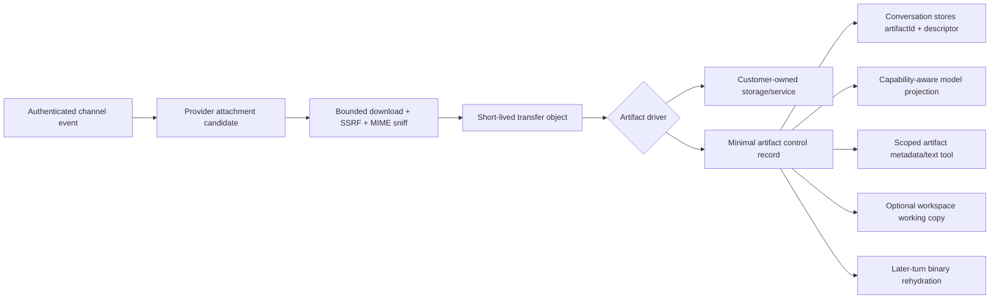

# Issue #25 Attachment Audit And Proposed Design

Status: **revised attachment foundation implementation candidate, not yet deployable**. Workspace materialization and bounded later-turn binary rehydration are implemented. Rehydration is capability-gated rather than provider-name-gated because the installed Google and Bedrock adapters also serialize multimodal tool results and MiniMax uses the Anthropic-compatible adapter; provider/model support for the declared MIME is still required. Convex codegen with a configured deployment is a hard pre-deploy blocker. The broader original issue remains open for deferred providers, direct upload APIs, coalescing, and processors.

Required pre-deploy gate: run `bun run --filter @filthy-panty/convex codegen` with `CONVEX_DEPLOYMENT` configured and review the committed `_generated/api.d.ts` addition for `artifacts`. This worktree has no Convex deployment credentials, so the generated binding cannot be produced or honestly marked complete here.

Post-implementation review corrections:

- Rehydration now permits only one projection per artifact per invocation, reserves the byte budget before I/O to prevent parallel-call races, and releases request-local bytes after output conversion.
- Multimodal tool-result rehydration is gated by explicit MIME capabilities rather than a stale provider-name allowlist; each configured provider/model must accept the declared MIME.
- Compaction parses descriptor metadata and retains only canonical validated artifact IDs instead of promoting descriptor-shaped user text verbatim into a system message.
- Idempotent ingress rejects a persisted artifact whose driver identity differs from the current policy rather than implicitly migrating or misrouting its opaque reference.
- Remaining pre/post-release concerns are driver configuration revisioning, typed workspace-required dispositions, workspace-copy deletion semantics, ingress module decomposition, and the explicitly deferred roadmap items below.

## Implementation Status

- [x] **1 Channel coverage:** Telegram, Slack, and Pancake photo/video inbound provider-event extraction is implemented. Discord ordinary messages require a separate stateful Gateway service; GitHub Markdown links and Zalo media remain explicitly unsupported rather than guessed.
- [x] **2 Later access:** tenant/conversation-scoped artifact records exist in DynamoDB and Convex, history uses artifact IDs/descriptors, and the read-only scoped model tool reads metadata plus bounded text/JSON without exposing URLs. Tool content is available only to the live model step and is redacted from persisted history. A public artifact API is a separate future feature.
- [ ] **3 Model projection (partial):** `model.inputCapabilities.imageMediaTypes` and `fileMediaTypes` gate current-turn image/file parts and later-turn tool-result projection. Multiple distinct artifacts are supported within the aggregate byte budget; each artifact projects at most once per invocation. The unused processor-text branch was removed; summaries/transcription should be added only with a real processor and persisted provenance contract.
- [x] **4 Download guards:** header, body-idle, resolver, total timeout, redirect, DNS, and byte ceilings are implemented with focused tests. Artifact GETs and remote-driver POSTs pin a validated public DNS answer into the TLS socket while retaining the original hostname for certificate/SNI validation.
- [x] **5 Content validation:** magic-byte sniffing, conflicting MIME checks, active-content rejection, safe filenames, and checksum metadata are implemented. Malware scanning remains a driver concern and is not claimed.
- [x] **6 Partial failures:** attachment processing degrades per item, preserves text, uses deterministic artifact identity, retries bounded driver calls, keeps successful remote commits intact when staging cleanup fails, and compensates a lost ready-state race with remote deletion. The bucket lifecycle remains the backstop for cleanup failures.
- [x] **7 Exact event association:** channel media is keyed by its ingress event and persisted as descriptors. Direct-API inline media remains request-local; a two-step direct artifact API is deferred.
- [ ] **8 Bounded outbound reads (partial):** `channel_message` uses a bounded S3 read before provider upload and derives MIME from bytes. Driver-based outbound sends and broader memory/load tests remain open.
- [x] **9 Provider-specific actions:** effective actions are adapter API support intersected with agent policy; provider reaction enums are adapter-declared. Continue expanding provider contract fixtures as adapters grow.
- [ ] **10 Telegram albums:** durable media-group/file-plus-text coalescing is not implemented.
- [x] **11 Pancake:** verified photo/video fields support media-only inbound events and guarded downloads; inbox photo/video sends use the documented upload/content-ID flow. Comment media and document/audio variants remain disabled pending fixtures.
- [x] **12 Tests:** focused downloader, MIME, projection, remote-driver protocol, storage, adapter, action, session, webhook-to-persistence flow, and infrastructure assertions exist. Optional live-provider tests remain outside normal CI.
- [x] **13 Staging retention:** staging is a dedicated non-versioned bucket, successful remote transfer deletes immediately, and remaining objects become eligible for asynchronous lifecycle deletion after one day.
- [x] **14 Workspace processing:** complex artifacts can be materialized from integrity-checked artifact storage into one routed writable workspace, and supported binaries can be rehydrated for a later model step without persisting bytes. Extraction and derived processors remain separate.

Additional runtime status: remote driver `store`, scoped read-time `resolve`, and compensating `delete` are implemented. Uploaded artifact drivers are deliberately absent until a hardened runner exists. No public artifact lifecycle endpoints are claimed. Account deletion removes core control records and managed staging objects; developer-owned remote retention remains the developer's responsibility.

## Design Decision

Durable attachment bytes should not be owned by filthy-panty by default. Split the system into:

1. **Control plane owned by filthy-panty**: artifact ID, account/agent/conversation scope, media metadata, checksum, driver ID, opaque external reference, state, and audit timestamps.
2. **Data plane selected by the developer**: their S3/R2/GCS/Azure/database/service. The public SDK now provides the remote-driver protocol types and a replay-safe verifier/router; uploaded-code execution remains future work.
3. **Short-lived transfer plane**: a separate non-versioned staging bucket used only to hand bytes to a remote driver or provide managed ephemeral access. Delete the transfer object immediately after successful remote `store`; keep a short lifecycle as crash cleanup.

Presigned URLs are appropriate for short-lived transfer capabilities, not durable references. Conversation history stores an opaque `artifactId`; any later read asks the configured driver to resolve fresh access. AWS documents that presigned access is time-limited, inherits the signer permissions, and may expire early with temporary credentials: [S3 presigned URLs](https://docs.aws.amazon.com/AmazonS3/latest/userguide/using-presigned-url.html).

## Target Flow



The channel adapter owns provider-specific extraction and URL refresh. The shared ingestion service owns validation and transfer. The artifact driver owns durable storage. Model projection is separate from storage. Workspace materialization and rehydration resolve artifact storage and never redownload from the channel provider. Content processors remain a future orchestration layer.

## Workspace Materialization And Processor Boundary

Artifact storage remains the source of truth. A workspace is an optional working copy for tools that need filesystem operations such as archive extraction, conversion, OCR, or transcription. When materialization is enabled, validated bytes must be copied from artifact storage into a collision-safe path such as:

```text
.artifacts/<artifactId>/<safe-filename>
```

The filename remains visible to the model, but it cannot be the identity: filenames are untrusted, mutable, and commonly duplicated. The artifact ID preserves tenant/conversation ownership, checksum provenance, idempotent retry, exact deletion, and later retrieval. The persisted descriptor should include both `artifactId` and `workspacePath` when a working copy exists.

Routing rules:

- With exactly one writable workspace, core may use it as the default artifact workspace.
- With multiple writable workspaces, the agent must reference the intended workspace explicitly.
- Read-only workspaces cannot receive materialized artifacts.
- Without a writable workspace, model-supported image/file bytes may still be projected for the current turn; complex files remain descriptor-only.
- Materialization does not automatically unpack or execute an attachment. Sandboxed tools or a configured processor perform that work under archive/file-count/size/path-traversal limits.
- Later turns must rehydrate supported binary content from artifact storage or use persisted derived text. Provider URLs are never the fallback source.

Default file-processing policy:

- Images and model-supported PDF/file MIME types use direct model projection; a workspace copy is optional unless a tool must manipulate the file.
- ZIPs, archives, unsupported documents, OCR, conversion, and transcription require both a writable workspace and a sandbox or explicit processor.
- Audio is descriptor-only by default unless the selected model explicitly supports its MIME type or an explicitly configured processor accepts it.
- Archive processing must reject absolute paths and traversal, bound nesting depth, extracted byte total, entry count, per-entry size, CPU time, and output size before exposing derivatives.
- Multiple attachments do not inherently require a workspace. The requirement is based on the processing operation, not attachment count.

Keep the extension points distinct:

| Extension | Responsibility | Current status |
| --- | --- | --- |
| Remote artifact driver | Developer-owned durable `store` / `resolve` / `delete` | Implemented |
| Uploaded model tool | Business logic explicitly invoked by the model | Implemented; not an ingestion hook |
| Workspace materializer | Copy a validated artifact into the selected workspace | Implemented for `never` / `complex` / `all` routing |
| Artifact processor | OCR, extraction, conversion, transcription, and derived-artifact provenance | Not implemented |
| Uploaded artifact driver | Platform-hosted developer storage code | Not accepted until a dedicated hardened runner exists |

Driver code defines how the developer stores bytes. Agent configuration selects which driver and workspace apply to that agent. Keep the declarative surface small and resource-based:

```ts
artifacts: {
  driver: customerStorage,
  workspace: { name: "attachments", materialize: "complex" },
  processing: {
    audio: "reject",
    archives: "workspace",
    unsupportedFiles: "workspace",
  },
}
```

Secure defaults determine materialization behavior; processing policy is agent-level and is never duplicated as channel booleans. The current policy selects descriptor versus workspace handling but does not itself execute a processor. A future processor resource or hook remains separate from the storage driver because storage credentials and untrusted file execution require different isolation boundaries.

### Release Sequencing

Do not deploy the attachment feature while its documented later-turn image behavior is knowingly incomplete. Complete workspace materialization and binary rehydration first, then run Convex codegen once after the final schema/function shape is stable.

1. Implement workspace materialization, routing, integrity checks, cleanup semantics, and model-visible `workspacePath` descriptors.
2. Implement conversation-scoped later-turn binary rehydration without persisting bytes in model history.
3. Update DynamoDB/Convex contracts only if materialization or derivative provenance adds persisted fields.
4. Run Convex codegen with the configured deployment and review generated bindings.
5. Run the complete typecheck, test, build, docs, dashboard, demo, and security gates.
6. Deploy the coherent attachment release through the normal `dev` CI/CD path.
7. Add derived-artifact processors and additional provider adapters as separate, fixture-backed phases.

## Finding Fixes

### 1. [P1] Required Channel Coverage Is Incomplete

**Original problem:** channel coverage and capability claims were inconsistent. Telegram, Slack, and Pancake photo/video media are now implemented. Discord ordinary messages, GitHub Markdown-link imports, and Zalo media remain intentionally unsupported as tracked above.

**Fix:**

- Add an adapter-declared capability manifest. Configuration is policy; it must never claim provider support.
- Telegram: retain Bot API `getFile`, add media-group batching, refresh `file_path` at download time, and respect the hosted Bot API 20 MB download ceiling.
- Slack: retain token-authenticated `url_private_download`, preserve `fileId`, and fall back to an attachment placeholder when download fails. OpenClaw follows this degraded behavior rather than dropping the message: [OpenClaw Slack media](https://github.com/openclaw/openclaw/blob/main/docs/channels/slack.md).
- Discord: add a stateful Gateway connector for `MESSAGE_CREATE`; the existing interaction-only Lambda cannot receive ordinary messages. Request the required intents and document that attachment/content fields depend on `MESSAGE_CONTENT`: [Discord Gateway intents](https://docs.discord.com/developers/topics/gateway), [Discord message attachments](https://docs.discord.com/developers/resources/message).
- GitHub: GitHub has no structured issue-attachment upload API. Parse only GitHub-owned Markdown attachment links from authenticated comment events, use a strict GitHub host allowlist, and document this as link ingestion rather than native attachments. Do not fetch arbitrary Markdown links.
- Pancake: accept verified photo/video fields from authenticated webhooks, use the shared DNS-pinned downloader without forwarding provider credentials, and keep unknown attachment variants disabled until fixtures establish their shape.
- Zalo: keep media disabled until official download hosts and codec bytes are established by redacted fixtures. OpenClaw remains supporting evidence, but the current official contract is authoritative: [Zalo webhook](https://bot.zapps.me/docs/webhook/).

**Acceptance:** fixture-backed inbound and attachment-only tests for every supported provider; unsupported media is explicitly declared and does not create a model tool.

### 2. [P1] Temporary Artifacts Cannot Be Accessed Later

**Original problem:** history contained an internal temporary key with no supported resolver. Artifact records now remove that key from history, but public later-access operations remain open.

**Fix:** replace internal keys with an artifact registry and driver reference:

```ts
interface ArtifactRecord {
  artifactId: string;
  accountId: string;
  agentId: string;
  conversationKey: string;
  sourceEventId: string;
  driverId: string;
  externalRef: string; // opaque, bounded, never a signed URL
  filename: string;
  mediaType: string;
  kind: "image" | "audio" | "video" | "document" | "file";
  size: number;
  sha256: string;
  state: "pending" | "ready" | "failed" | "expired" | "deleted";
  createdAt: string;
}
```

- Keep current model access read-only (`get` plus bounded text/JSON `read`). Add authenticated public lifecycle operations only as a separate API design with explicit authorization and retention semantics.
- Add a channel-neutral model tool that reads only artifact IDs already scoped to the active account/conversation.
- Resolve a fresh driver URL or byte stream on every access; never persist access URLs.
- Store only minimal metadata in filthy-panty. Durable bytes and retention belong to the developer driver.
- Add artifact storage interfaces to both DynamoDB and Convex backends. This new record type **does require** Convex schema/functions/codegen, unlike the current nested channel config.

**Acceptance:** an artifact remains addressable after a later turn and after compaction, or returns an explicit `expired/deleted` state from its driver.

### 3. [P1] Model Projection Ignores Model/Provider Capabilities

**Original problem:** all media was projected without checking model support. Explicit MIME capability projection is now implemented; processors and attributed summaries remain open. AI SDK states that not all models support every content type and file support is limited: [AI SDK prompts](https://ai-sdk.dev/docs/foundations/prompts).

**Fix:** introduce an `ArtifactProjectionPlanner` independent of storage:

- Image + vision-capable model: validated bytes as an image part.
- Image + text-only model: configured image-understanding processor produces an attributed text summary; retain artifact ID for tools.
- Audio/voice: configured transcription processor; attach original only when the selected model explicitly supports that audio type.
- Video: configured video processor or audio transcript/key-frame summary; otherwise descriptor + tool access.
- PDF/document: provider-supported file part or sandboxed text extraction; otherwise descriptor + tool access.
- Unknown binary: descriptor plus optional workspace working copy; rehydration only when the configured model explicitly supports its MIME type.
- Treat extracted text as untrusted external content with explicit boundaries and source metadata. OpenClaw uses this pattern: [OpenClaw media understanding](https://github.com/openclaw/openclaw/blob/main/docs/nodes/media-understanding.md).
- Persist summary provenance: processor type, provider/model or extractor version, source artifact checksum, timestamp, and failure state.
- Do not use AI SDK default auto-download for provider or customer URLs. If `experimental_download` is ever used, supply the guarded resolver and treat the API as experimental.

**Acceptance:** each configured model/provider has projection tests for supported and unsupported image, audio, video, PDF, and generic-file cases; unsupported media never fails the whole turn.

### 4. [P1] Download Timeout Does Not Cover The Body Stream

**Original problem:** the abort timer ended after headers. The guarded downloader now retains total and idle body timeouts.

**Fix:**

- Keep a total timeout active until the reader completes.
- Add a shorter connect/header timeout and a resettable idle timeout between chunks.
- Apply the same limits to provider metadata calls such as Telegram `getFile`.
- Cancel the reader and abort the request on size, idle, or total timeout.
- Validate every redirect and cap redirect count.
- Prefer a shared tested downloader; OpenClaw Slack explicitly uses bounded idle and total timeouts.

**Acceptance:** tests for stalled headers, stalled body, slow continuous body, abort cleanup, redirect timeout, and provider-resolver timeout.

### 5. [P1] MIME Validation Does Not Inspect Content

**Original problem:** validation trusted declared metadata and HTTP `Content-Type`. Content sniffing and conflict checks are now implemented.

**Fix:**

- Stream the first bounded prefix through magic-byte detection before committing storage.
- Compare detected, provider-declared, HTTP, and filename-derived types with a documented conflict policy.
- Reject or quarantine active content (`text/html`, SVG, scripts) and polyglot/mismatch cases.
- Treat ZIP/Office containers as generic documents until a sandboxed extractor verifies them.
- Use sanitized filenames only for display; identity is `artifactId` + checksum.
- Add optional developer-driver malware scanning/quarantine state, but never claim antivirus protection when none ran.
- Continue URL normalization, redirect validation, and IP controls. OWASP highlights DNS rebinding and redirect bypasses in Node SSRF defenses: [OWASP SSRF prevention](https://owasp.org/www-community/pages/controls/SSRF_Prevention_in_Nodejs.html).

**Acceptance:** fixtures for mislabeled HTML/SVG, polyglots, valid common formats, truncated files, content-type conflicts, and reserved/private DNS results.

### 6. [P1] Attachment Failure Drops The Entire Message

**Original problem:** one failure rejected text and all attachments and could orphan writes. Per-item degradation and staging cleanup are implemented; retry and compensation work remains.

**Fix:**

- Give every candidate a deterministic idempotency key derived from account/agent/event/provider attachment ID.
- Process attachments into per-item results: `ready`, `skipped`, or `failed`.
- Persist and process user text even when every attachment fails.
- Add a safe descriptor such as `[Attachment unavailable: report.pdf; reason=size_limit]`; do not expose provider URLs or raw internal errors.
- Stage before durable commit. Delete staging immediately after driver success.
- On a driver failure, retry transient errors with bounded backoff, preserve the message, and add a bounded unavailable descriptor for that item.
- Use cleanup compensation for objects created before a failed commit. Workspace/external drivers must implement idempotent `store` and `delete`.

**Acceptance:** mixed success, all failure, retry, duplicate webhook, partial driver commit, cleanup failure, and text-plus-invalid-file tests.

### 7. [P1] Direct API Media-Only Messages Are Unreliable

**Original problem:** request-local bytes could be attached to the wrong user message. Event-keyed current-turn media and persisted descriptors are implemented; direct artifact upload/reference remains open.

**Fix:**

- Key pending media by the exact ingress event/message ID; never search for the latest prior user message.
- Always persist a new user envelope containing artifact descriptors, even when there is no text.
- Clear request-local media after the turn finishes; deliberately re-project by artifact ID for later continuation.
- Add a two-step direct API:
  1. `artifacts.createUpload()` returns a driver/staging upload instruction.
  2. The message sends `{ type: "artifact", artifactId }` rather than a remote URL or base64 blob.
- Keep inline bytes as a bounded convenience path that is immediately converted into an artifact record.
- Reject arbitrary remote URLs unless imported through a guarded `artifacts.importUrl` endpoint with an explicit allow policy.

**Acceptance:** new-conversation media-only, existing-conversation media-only, text+media, multiple user events, compaction, retry, and duplicate event tests.

### 8. [P2] Outbound Reads Are Unbounded Before Validation

**Original problem:** outbound workspace reads buffered the full object before checking size. The channel tool now uses a bounded read.

**Fix:**

- Call `HEAD`/driver metadata first and reject oversized objects before reading.
- Stream with an enforced byte ceiling; use bounded `Range` reads only when a provider requires buffering.
- Prefer streaming multipart uploads for channel providers. If an SDK requires a `Blob`, enforce the provider limit before allocation and account for Lambda memory.
- Use stored/sniffed MIME metadata; never accept model-supplied MIME as authoritative.
- Apply a total outbound budget and provider-specific count limit.

**Acceptance:** forged size metadata, missing size, stream overflow, large workspace object, driver stream stall, and Lambda-memory regression tests.

### 9. [P2] Outbound Validation Is Not Provider-Specific

**Original problem:** one generic schema accepted invalid reactions and media combinations. Adapter action schemas and policy intersection are implemented for current adapters.

**Fix:**

- Add adapter-declared action schemas and runtime capability probes. Effective actions are `adapter support ∩ runtime/provider support ∩ agent policy`.
- GitHub reaction schema must enumerate `+1`, `-1`, `laugh`, `confused`, `heart`, `hooray`, `rocket`, and `eyes`: [GitHub reactions](https://docs.github.com/en/rest/reactions/reactions).
- Telegram validates allowed reaction emoji and uses per-method size/media rules; the hosted Bot API currently caps downloads at 20 MB: [Telegram Bot API](https://core.telegram.org/bots/api).
- Slack uses `files.getUploadURLExternal`, uploads bytes, then calls `files.completeUploadExternal`, checking `ok` and provider errors at every step: [Slack upload URL](https://docs.slack.dev/reference/methods/files.getUploadURLExternal/), [Slack complete upload](https://docs.slack.dev/reference/methods/files.completeUploadExternal/).
- Discord validates upload count/size for the current context and handles provider 413/400 responses; keep `allowed_mentions` disabled by default.
- Use `mediaMaxMb` consistently for inbound and outbound only where it does not exceed a provider hard limit.

**Acceptance:** generated JSON schemas expose only supported actions, and provider contract tests cover every allowed/denied reaction and media kind.

### 10. [P2] Telegram Albums Are Not Grouped

**Open problem:** each update in one media group becomes a separate agent turn.

**Fix:** build a channel-neutral durable ingress coalescer:

- Key by account, agent, conversation, sender, and Telegram `media_group_id` when present.
- Preserve original ordering and provider IDs.
- Use a short configurable flush window; OpenClaw's Telegram default is 500 ms and it exposes `mediaGroupFlushMs`: [OpenClaw Telegram](https://github.com/openclaw/openclaw/blob/main/docs/channels/telegram.md).
- A generic attachment grace window can also combine “file, then question” messages without making this Telegram-only.
- Store the buffer durably so concurrent Lambda invocations do not create multiple turns. Use one lease/leader to flush and make the batch idempotent.

**Acceptance:** out-of-order updates, duplicate updates, caption on first/last item, partial album, concurrent invocations, and file-then-text batching tests.

### 11. [P2] Pancake Payload Support Must Stay Fixture-Backed

**Resolved safety boundary:** official schemas establish message attachments and the upload/content-ID send flow. The adapter accepts only verified photo `url` and video `video_data.url` fields, uses guarded public HTTPS downloads, and never persists provider URLs.

**Fix:**

- Keep photo/video contract tests aligned with the official webhook and API schemas.
- Capture redacted fixtures before enabling document, audio, sticker, template, or comment-media variants.
- Keep provider URL validation in `resolveDownload`; never persist URLs or forward the Pancake page token to media hosts.
- Keep outbound media to one content ID per call until the underlying platform is reliably known.
- Log only provider attachment IDs and normalized failure codes.

**Acceptance:** replay fixtures through signature/secret validation, resolver, expiry refresh, and download tests against a mock provider server.

### 12. [P2] Test Coverage Does Not Validate The Feature

**Fix:** add layered tests:

- Unit: URL/IP/redirect/timeouts, streaming limits, MIME sniffing, filenames, projection planner, capability intersection.
- Adapter contracts: redacted provider fixtures and outbound request snapshots.
- Storage contracts: managed ephemeral storage, remote driver, delete compensation, retry, idempotency, and tenant isolation.
- Session: media-only, descriptors, exact-message reattachment, pruning, compaction, continuation loops.
- End-to-end: webhook -> ACK -> ingest -> driver -> artifact record -> model projection -> reply.
- Infrastructure: staging lifecycle, bucket policy, IAM least privilege, Kubernetes security context, and no service-account token.
- Optional live tests remain opt-in and must not be required for normal CI.

**Acceptance:** tests fail if bytes enter conversation persistence, signed/provider URLs enter history, cross-account artifact reads succeed, or unsupported model parts are projected.

### 13. [P3] Seven-Day Deletion Is Overstated

**Original problem:** an exact seven-day deletion claim relied on versioned-bucket semantics. Staging now uses a dedicated non-versioned bucket with immediate cleanup and one-day deletion eligibility. AWS documents asynchronous lifecycle behavior: [S3 object expiration](https://docs.aws.amazon.com/AmazonS3/latest/userguide/lifecycle-expire-general-considerations.html).

**Fix:**

- Use a dedicated non-versioned staging bucket because transfer objects are not durable records.
- Delete staging objects immediately after driver success/failure cleanup.
- Add a short lifecycle fallback, incomplete-multipart cleanup, and monitoring for stale objects.
- Describe lifecycle timing as “eligible for deletion after” rather than an exact deletion guarantee.
- If versioning is retained, add noncurrent-version and expired-delete-marker cleanup and test the synthesized lifecycle.

**Acceptance:** infrastructure tests assert bucket versioning/lifecycle, and an operational metric alarms on staging objects older than the intended recovery window.

## Developer-Owned Artifact SDK

### Why This Is Not An Uploaded Tool

Uploaded tools are model-callable and return model results. Artifact storage is infrastructure invoked by deterministic lifecycle events. Reusing `defineTool()` would let model behavior control data custody and would mix tool approval semantics with required ingress persistence.

Remote HTTPS is the only deployable driver mode. An uploaded-code mode remains future work and must introduce a distinct resource and executor rather than reuse the custom-tool runtime.

### Public SDK Surface

```ts
import {
  defineAgent,
  defineRemoteArtifactDriver,
  env,
} from "filthy-panty";

const remoteStorage = defineRemoteArtifactDriver({
  name: "customer-api",
  config: {
    endpoint: "https://storage.example.com/filthy-panty/artifacts",
    signingSecret: env.ARTIFACT_WEBHOOK_SECRET,
    allowedHosts: ["storage.example.com"],
  },
});

export default defineAgent({
  name: "support",
  config: {
    artifacts: {
      driver: remoteStorage,
      fallback: "reject", // or explicit "managed-ephemeral"
    },
  },
});
```

### Remote Handler SDK

`filthy-panty/artifacts` exports the exact request/result types and `createArtifactDriverHandler()`. The helper verifies the timestamp, body digest, timing-safe HMAC, idempotency key, exact path/query, and an atomically claimed nonce before calling required `store`, `resolve`, or compensating `delete` handlers. See `packages/demos/channel-telegram/artifact-driver.ts` for the runnable implementation; production nonce claims must use shared durable storage.

```ts
import { createArtifactDriverHandler } from "filthy-panty/artifacts";

export default createArtifactDriverHandler({
  signingSecret: process.env.ARTIFACT_DRIVER_SIGNING_SECRET!,
  basePath: "/filthy-panty/artifacts",
  claimNonce: (nonce, expiresAt) => nonceStore.claim(nonce, expiresAt),
  handlers: {
    store: (input) => storage.storeFromTransfer(input),
    resolve: (input) => storage.createReadGrant(input.externalRef),
    delete: (input) => storage.delete(input.externalRef),
  },
});
```

### Driver Contract

```ts
interface ArtifactDriver {
  store(ctx: DriverContext, input: StoreArtifactInput): Promise<{
    externalRef: string;
    metadata?: Record<string, string>;
  }>;
  resolve(ctx: DriverContext, input: ResolveArtifactInput): Promise<{
    url: string;
    headers?: Record<string, string>;
    expiresAt: string;
  }>;
  delete(ctx: DriverContext, input: DeleteArtifactInput): Promise<void>;
}
```

Rules:

- `externalRef` is opaque, bounded, and not a URL containing credentials.
- `resolve` output is never persisted or sent to the model. Core validates its registered host, downloads with the guarded client, and projects bytes.
- Provider URLs and channel credentials never enter driver context.
- `store` receives a short-lived transfer grant plus normalized metadata/checksum.
- Lifecycle calls are idempotent and include an invocation ID.
- Driver metadata is size/count bounded and secrets are redacted from logs.
- The context may include a sanitized channel subject/customer identifier so developers can partition their own customer data. It must exclude bot tokens and raw provider download URLs.

### Current And Future Modes

**Remote driver (recommended for full data control):** filthy-panty sends signed lifecycle requests to developer-hosted HTTPS. The developer owns runtime, credentials, region, storage, retention, and compliance. Requests use timestamp + nonce + body digest signatures, retries, idempotency keys, and an outbound host allowlist.

**Future uploaded driver:** the CLI may eventually bundle TypeScript/JavaScript and dependencies, but the platform must invoke lifecycle methods in a dedicated runner. This is not accepted by the current SDK, manifest, or core configuration.

### Uploaded Driver Security Requirements

Do not use the current custom-tool pod unchanged for storage credentials. The dedicated runner must set:

- `runAsNonRoot`, fixed UID/GID, `allowPrivilegeEscalation: false`, capabilities drop `ALL`.
- `seccompProfile: RuntimeDefault`; Kubernetes recommends runtime-default seccomp for a baseline syscall boundary: [Kubernetes seccomp](https://kubernetes.io/docs/reference/node/seccomp/).
- Read-only root filesystem plus bounded `emptyDir` for `/tmp` and bundle cache.
- `automountServiceAccountToken: false`, no AWS role, no workspace mount, and no cluster API access.
- CPU/memory/ephemeral-storage limits, foreground timeout, output limit, and maximum lifetime.
- Per-account/driver reservation keys and no cross-driver writable cache.
- Egress restricted to declared hosts through an egress proxy or DNS-aware policy. CIDR deny lists alone do not safely implement hostname allowlists.
- Encrypted secret grants delivered only to the selected driver. Do not place secrets in bundle metadata, command arguments, logs, or public `defaultConfig`.
- Bundle hash verification and immutable driver revisions; preserve the current local Bun bundling approach.

### Minimal Platform Data

Even in external-only mode, filthy-panty needs minimal routing metadata. Account deletion cascades core control records and managed staging objects. It does not delete developer-owned remote bytes because the developer selected and controls that data plane; the driver owner must implement its own customer retention and erasure workflow. Conversation text and artifact metadata remain platform control-plane data until core account deletion.

### Failure And Retention Policy

```ts
type ArtifactPolicy = {
  driver: ArtifactDriverResource;
  fallback?: "reject" | "managed-ephemeral";
};
```

- `reject`: a driver failure does not retain a managed byte copy; the message continues with an unavailable descriptor.
- `managed-ephemeral`: explicit compatibility fallback only, with a documented short eligibility window.
- Never silently fall back from developer-owned storage to long-lived platform storage.
- Compensating `delete` is required and idempotent for a remote `store` whose core metadata commit loses a race. Customer retention deletion remains outside the platform lifecycle.

## Implementation Order

1. Fix downloader timeout, streaming limits, MIME sniffing, and per-attachment failure handling.
2. Add artifact control records and storage-provider contracts in DynamoDB and Convex.
3. Add the short-lived transfer bucket and remove implicit seven-day temporary ownership.
4. Add artifact-reference message parts and exact-event session projection.
5. Implement capability-aware projection and attributed summaries/transcription.
6. Add remote artifact driver SDK and signed lifecycle protocol. **Implemented for remote HTTPS handlers; deployment validation remains open.**
7. Add collision-safe workspace materialization from artifact storage, explicit multiple/read-only workspace routing, and descriptors containing `workspacePath`.
8. Add later-turn binary rehydration for explicitly referenced model-supported artifacts; keep bytes out of persisted chat messages.
9. Add a separate artifact processor SDK/resource for extraction, OCR, conversion, or transcription with persisted derivative provenance. Do not treat uploaded model tools as automatic ingestion hooks.
10. Future: add uploaded artifact driver resources only after a hardened dedicated runner and infrastructure controls are implemented.
11. Add authenticated artifact lifecycle/direct-upload APIs; keep the model tool read-only.
12. Complete provider adapters and durable message/media coalescing.
13. Run the full security/provider/storage/session/infrastructure test matrix before enabling each new phase.

## Research Sources

- [AI SDK multimodal prompts and custom download behavior](https://ai-sdk.dev/docs/foundations/prompts)
- [Issue #25](https://github.com/beeblastco/filthy-panty/issues/25)
- [OpenClaw media understanding](https://github.com/openclaw/openclaw/blob/main/docs/nodes/media-understanding.md)
- [OpenClaw Telegram](https://github.com/openclaw/openclaw/blob/main/docs/channels/telegram.md)
- [OpenClaw Slack](https://github.com/openclaw/openclaw/blob/main/docs/channels/slack.md)
- [OpenClaw Discord](https://github.com/openclaw/openclaw/blob/main/docs/channels/discord.md)
- [Discord Gateway](https://docs.discord.com/developers/topics/gateway)
- [Discord message attachments](https://docs.discord.com/developers/resources/message)
- [GitHub reactions](https://docs.github.com/en/rest/reactions/reactions)
- [Telegram Bot API](https://core.telegram.org/bots/api)
- [Slack external upload start](https://docs.slack.dev/reference/methods/files.getUploadURLExternal/)
- [Slack external upload completion](https://docs.slack.dev/reference/methods/files.completeUploadExternal/)
- [AWS S3 presigned URLs](https://docs.aws.amazon.com/AmazonS3/latest/userguide/using-presigned-url.html)
- [AWS S3 object expiration](https://docs.aws.amazon.com/AmazonS3/latest/userguide/lifecycle-expire-general-considerations.html)
- [AWS S3 checksum validation](https://docs.aws.amazon.com/AmazonS3/latest/userguide/checking-object-integrity-upload.html)
- [OWASP SSRF prevention for Node.js](https://owasp.org/www-community/pages/controls/SSRF_Prevention_in_Nodejs.html)
- [Kubernetes seccomp](https://kubernetes.io/docs/reference/node/seccomp/)
